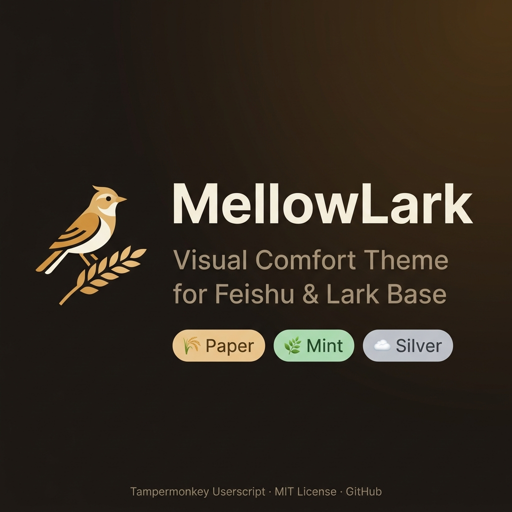
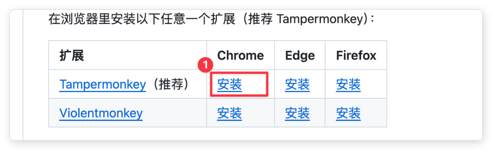
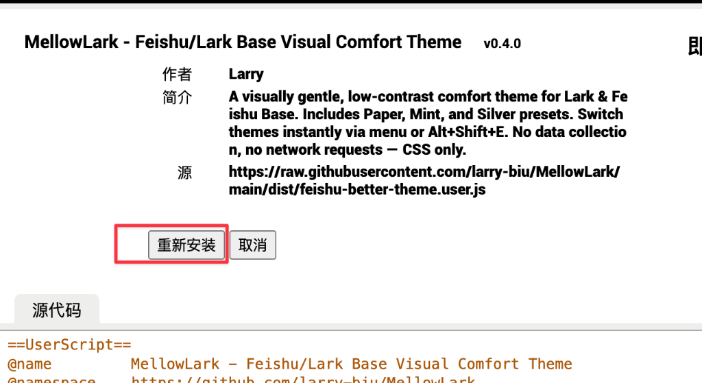
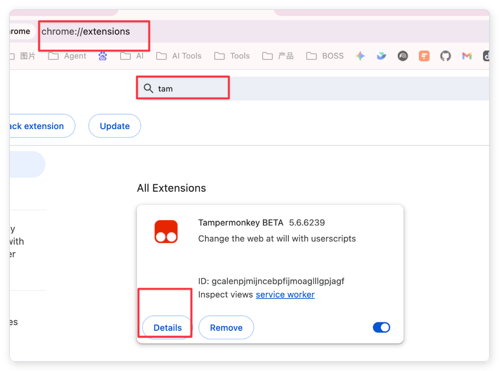
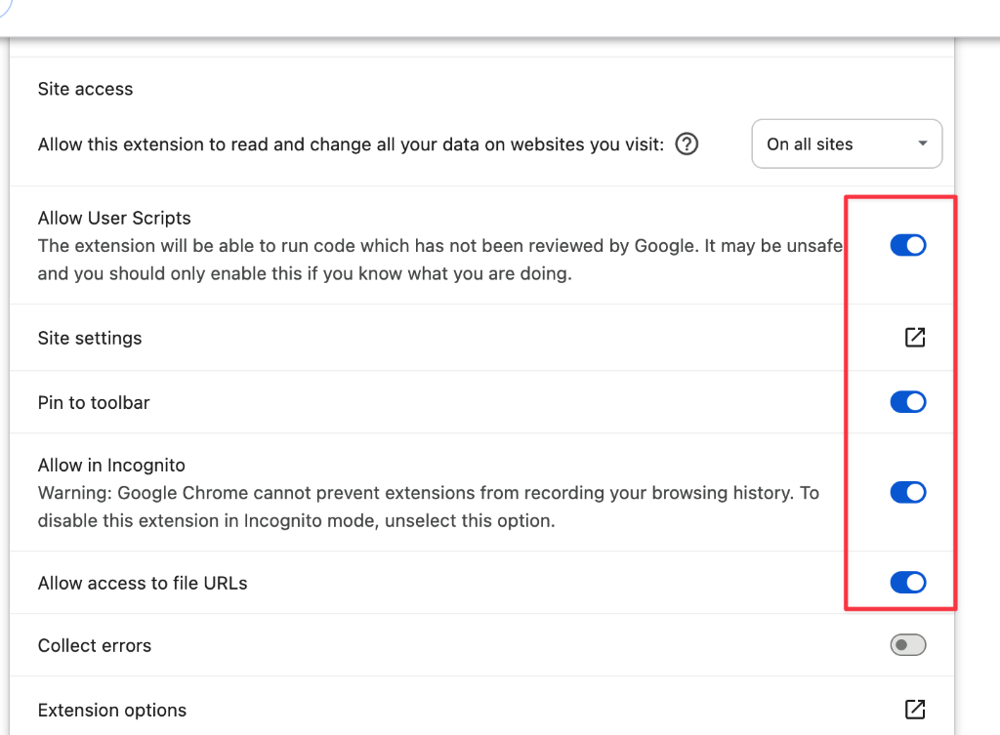
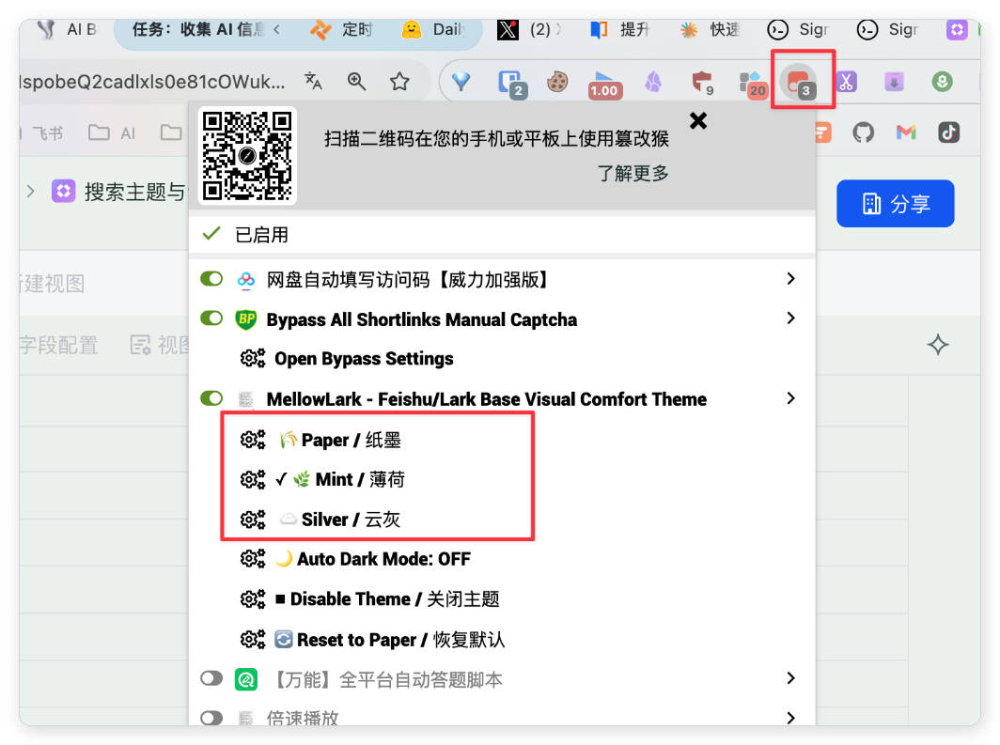

  

# MellowLark

  

  <strong>为飞书多维表格打造的视觉舒适主题 · Visual Comfort Theme for Feishu & Lark Base</strong>

  
  
  
  
  

---

> 语言 / Language：**[中文](#-中文说明)** · [English](#-english)

---

## 🇨🇳 中文说明

### 这是什么？

**MellowLark** 是一个 [Tampermonkey](https://www.tampermonkey.net/) 浏览器脚本。

它会在你打开飞书多维表格（Base）时，自动替换页面的高亮白色背景、强对比网格线为更柔和的配色方案，让长时间盯着表格工作变得不那么费眼睛。

**适合哪些人？**

- 📊 **财务 / 会计**：每天在飞书 Base 里对账、核数、录入数据
- 📋 **运营 / 项目管理**：长时间查看多维表格跟进项目进展
- 🗂️ **HR / 行政**：用飞书 Base 管理花名册、审批记录、档案
- 👀 **任何觉得飞书白色背景太刺眼的人**

> [!NOTE]
> **MellowLark 是一个视觉舒适主题，不是护眼软件，也不是医疗产品。**
> 它只修改网页样式，不会触碰你的任何数据，不联网，不收集任何信息。

---

### ⚙️ 图文安装步骤

#### 1️⃣ 第一步：安装油猴管家扩展 (Tampermonkey)
在下方的表格中找到推荐的 **Tampermonkey** 插件，点击对应的 **「安装」** 链接跳转到应用商店：

| 扩展 | Chrome | Edge | Firefox |
|:---|:---|:---|:---|
| [Tampermonkey](https://www.tampermonkey.net/)（推荐） | [安装（点击红框 1）](https://chrome.google.com/webstore/detail/tampermonkey/dhdgffkkebhmkfjojejmpbldmpobfkfo) | [安装](https://microsoftedge.microsoft.com/addons/detail/tampermonkey/iikmkjmpaadaobahmlepeloendndfphd) | [安装](https://addons.mozilla.org/firefox/addon/tampermonkey/) |

在应用商店页面点击 **「添加至 Chrome」**（或 **「获取」**），并在弹出的确认框中选择 **「添加扩展程序」**。

🔍 点击展开/折叠「第一步：安装油猴扩展」截图

 

  

---

#### 2️⃣ 第二步：一键安装 MellowLark 主题脚本
油猴扩展安装好后，点击下方的脚本安装链接，一键将配色方案载入浏览器：

👉 **[从 GitHub 直接安装（点击此链接）](https://raw.githubusercontent.com/larry-biu/MellowLark/main/dist/feishu-better-theme.user.js)**

在浏览器自动弹出的安装页面中，点击左侧红框中的 **「安装」** (或 **「重新安装」**) 按钮。点击后该页面会自动关闭，脚本即安装成功。

🔍 点击展开/折叠「第二步：安装脚本」截图

 

  
    
  

---

#### 3️⃣ 第三步：配置扩展程序权限（⚠️ 关键步骤）
由于 Chrome 新版浏览器的安全机制，我们需要手动开启以下几项扩展权限，否则本主题在飞书网页中无法正常加载。
1.  **打开管理页面**：在浏览器地址栏输入 `chrome://extensions/` 并回车。
    *   *提示：如果打不开，可以点击浏览器右上角的 **「三点菜单」 -> 「扩展程序」 -> 「管理扩展程序」**。*
2.  **搜索并进入详情**：在搜索框中输入 `tam`，找到 **Tampermonkey**，点击其下方的 **「Details (详细信息)」** 按钮。

🔍 点击展开/折叠「第三步：配置扩展权限」截图

 

  

3.  **开启所有必要开关**：将以下右侧红框中的 4 个开关全部**开启（使滑块变成蓝色激活状态）**：
    *   **Allow User Scripts (允许用户脚本)**：允许运行用户脚本（本主题核心权限）。
    *   **Pin to toolbar (固定到工具栏)**：方便我们在右上角一键切换皮肤。
    *   **Allow in Incognito (在无痕模式下启用)**
    *   **Allow access to file URLs (允许访问文件网址)**

🔍 点击展开/折叠「第三步：开启权限开关」截图

 

  

---

#### 4️⃣ 第四步：进入飞书，切换护眼配色
1.  在浏览器中登录网页版飞书（feishu.cn），打开任意一个多维表格（Base）。
    *   *注：本主题目前仅支持网页端，飞书桌面客户端暂不支持。*
2.  点击浏览器右上角已固定的 **油猴 🐒 图标**（如果看不到，先点击拼图 🧩 图标）。
3.  在弹出的油猴菜单列表中，找到 MellowLark 项目下方，点击选择您想要的配色样式（🌾 纸墨、🌿 薄荷、☁️ 云灰）。当前激活的主题前面会有 `✓` 标记。点击 **Disable Theme / 关闭主题** 可以恢复网页的原始颜色。

🔍 点击展开/折叠「第四步：切换护眼配色」截图

 

  

---

### ⌨️ 进阶小技巧：快捷键一键开关

如果您在向同事演示或截图时需要临时恢复飞书原本的高对比度白色配色，无需每次都去点猴子菜单。您可以使用键盘快捷键：
*   **Windows 电脑**：同时按下 `Alt + Shift + E`。
*   **Mac 电脑**：同时按下 `option + shift + E`。
*   按下即可在“舒适配色”和“飞书默认配色”之间瞬间切换。

> [!NOTE]
> 如果您按下快捷键没有反应，可能是该键位被电脑里的其他软件（如QQ/微信/网易云等快捷热键）占用了，推荐直接使用右上角的 🐒 菜单进行切换。

---

### 主题颜色对照表

| 颜色用途 | 🌾 纸墨 | 🌿 薄荷 | ☁️ 云灰 |
| :--- | :--- | :--- | :--- |
| 页面背景 | `#F4F0E6` | `#EAF1EC` | `#EEF2F5` |
| 表格画布 | `#FDFBF7` | `#F0F4F1` | `#F8FAFC` |
| 列头背景 | `#F1E8D7` | `#DDEBE1` | `#E5EBF1` |
| 网格线颜色 | `#D5D1C4` | `#BFD2C3` | `#CDD6DF` |
| 悬停高亮 | `#F0EDE1` | `#E6F0E9` | `#EDF3F8` |
| 选中状态 | `#E3DEC9` | `#D4E6D8` | `#DDE7F3` |

---

### 常见问题（FAQ）

**Q：安装后没有效果怎么办？**

A：请确认：
1. Tampermonkey 扩展已启用（浏览器扩展栏里图标不是灰色）
2. 脚本已安装并且处于开启状态（Tampermonkey 仪表板里 MellowLark 旁边是绿点）
3. 页面地址是 `feishu.cn` 或 `larksuite.com` 的域名
4. 尝试刷新页面

**Q：会不会影响我的飞书数据？**

A：完全不会。MellowLark 只修改网页的视觉样式（CSS），不会读取、修改或上传任何数据。脚本里没有任何 network 请求代码，你可以自行查看 [feishu-better-theme.user.js](feishu-better-theme.user.js) 源代码确认。

**Q：飞书更新后主题失效了怎么办？**

A：飞书是 SPA（单页应用），偶尔更新可能导致部分样式失效。遇到这种情况，请在 [Issues](https://github.com/larry-biu/MellowLark/issues) 里反馈，我会尽快修复。

**Q：能支持飞书文档 / 知识库 / 电子表格吗？**

A：目前主要支持多维表格（Base）。对其他模块的支持在路线图中，参见 [ROADMAP.md](ROADMAP.md)。

**Q：可以自定义颜色吗？**

A：当前版本不支持，但这是 v0.5 的计划功能。如果你有配色需求，可以直接修改 [feishu-better-theme.user.js](feishu-better-theme.user.js) 里的 `THEMES` 对象，每个颜色 token 都有注释说明用途。

**Q：Mac 还是 Windows 更适合使用？**

A：两者都支持，Chrome / Edge / Firefox 均可。

---

### 安全性说明

MellowLark 对你的隐私和数据安全无任何影响：

- ✅ **只注入 CSS**，不操作 DOM 数据
- ✅ **零网络请求**，不访问任何外部地址
- ✅ **不收集信息**，无埋点、无统计、无分析
- ✅ **代码完全开源**，可自行审计 [feishu-better-theme.user.js](feishu-better-theme.user.js)
- ✅ **MIT 开源协议**，可自由使用、修改、分发

---

### 参与贡献 / 反馈问题

- 🐛 **发现 Bug**：[提交 Issue](https://github.com/larry-biu/MellowLark/issues/new?template=bug_report.md)
- 💡 **功能建议**：[提交 Feature Request](https://github.com/larry-biu/MellowLark/issues/new?template=feature_request.md)
- 🤝 **参与开发**：欢迎 Fork 仓库并提交 PR 反馈。

---

## 🌐 English

### What is MellowLark?

**MellowLark** is a Tampermonkey userscript that gently replaces Feishu/Lark Base's high-contrast white interface with soft, curated, low-contrast color palettes — making long data entry sessions more comfortable.

It works by injecting a small CSS override at page load. It does **not** touch your data, make network requests, or collect any information.

> [!NOTE]
> **MellowLark is a comfort theme, not an eye-care or medical product.** It is designed to reduce visual fatigue during heavy spreadsheet work, drawing design inspiration from Notion, standard office tools, and classic reading interfaces.

### Installation

**Step 1 — Install a userscript manager:**

- [Tampermonkey](https://www.tampermonkey.net/) (Recommended) — Chrome / Edge / Firefox
- [Violentmonkey](https://violentmonkey.github.io/) — Alternative

**Step 2 — Install MellowLark:**

Click this link to install directly:

👉 **[Install from GitHub Raw](https://raw.githubusercontent.com/larry-biu/MellowLark/main/dist/feishu-better-theme.user.js)**

**Step 3 — Open Feishu/Lark Base** and the theme applies automatically.

### Themes

| Theme | Feel | Best For |
|:---|:---|:---|
| 🌾 **Paper** (纸墨) | Warm cream white | Everyday office work |
| 🌿 **Mint** (薄荷) | Soft pale green | Long data entry sessions |
| ☁️ **Silver** (云灰) | Modern cool gray | Notion/Office-style preference |

### Usage

- **Switch themes**: Click the Tampermonkey icon → MellowLark → choose a preset (active theme shows `✓`)
- **Toggle on/off**: Press `Alt + Shift + E`
- **Reset to default**: Tampermonkey menu → Reset to Paper

### Presets Color Reference

| Element | 🌾 Paper | 🌿 Mint | ☁️ Silver |
| :--- | :--- | :--- | :--- |
| Page Body | `#F4F0E6` | `#EAF1EC` | `#EEF2F5` |
| Base Canvas | `#FDFBF7` | `#F0F4F1` | `#F8FAFC` |
| Header | `#F1E8D7` | `#DDEBE1` | `#E5EBF1` |
| Borders | `#D5D1C4` | `#BFD2C3` | `#CDD6DF` |
| Hover | `#F0EDE1` | `#E6F0E9` | `#EDF3F8` |
| Selected | `#E3DEC9` | `#D4E6D8` | `#DDE7F3` |

### Roadmap

See [ROADMAP.md](ROADMAP.md) for planned milestones from v0.4 (selector stability) through v1.0 (stable release).

### Contributing

Contributions welcome!

1. Fork this repository
2. Edit [feishu-better-theme.user.js](feishu-better-theme.user.js)
3. Submit a Pull Request

---

## 📄 License

MellowLark is released under the [MIT License](LICENSE). Free to use, modify, and distribute.
